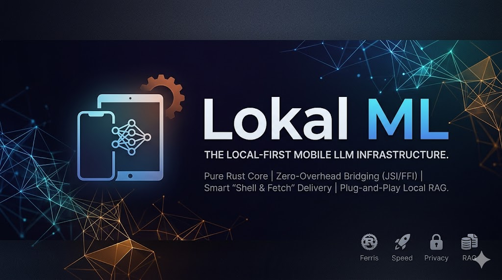

# Lokal ML (@lokal-ml)

> **The Local-First Mobile LLM Infrastructure. Zero friction. Pure Rust. Native Edge AI.**

> [!WARNING]
> **Active Development — Not Production Ready**  
> The Rust core (hardware profiler, resumable downloader, GGUF inference engine, TalaDB RAG embedder) is implemented. The React Native JSI bridge and TypeScript API surface are still being wired up. APIs are unstable and subject to change. Contributions and early feedback are very welcome — star the repo to follow progress.

---

## The Problem

Running Small Language Models (SLMs) like Gemma directly on mobile devices is the future of privacy-first, zero-latency applications. But today, the Developer Experience (DX) is fundamentally broken:

- **The App Store Trap:** Bundling a 1.5 GB+ `.gguf` quantized model directly into an app binary destroys user acquisition and violates App Store cellular download limits.
- **The C++ Boilerplate:** React Native and Flutter developers are forced to wrestle with complex C++ wrappers, asynchronous bridging overhead, and memory leaks just to stream tokens.
- **The RAG Fragmentation:** Building offline Retrieval-Augmented Generation (RAG) requires developers to manually stitch together text chunkers, separate embedding models, and local vector databases.

---

## Architecture

| Layer | Description |
|---|---|
| 🦀 **Pure Rust Core** | Memory-safe GGUF inference via `llama-cpp-2` — Metal GPU on iOS/macOS, NEON on Android ARM64, CPU fallback everywhere else |
| ⚡ **Zero-Overhead Bridging** | Direct JSI for React Native, `flutter_rust_bridge` FFI for Flutter — per-token streaming via C-ABI callbacks, no async bottlenecks |
| 📦 **Shell & Fetch Delivery** | Resumable background downloader with HTTP Range support and SHA-256 integrity verification. Device hardware is profiled before any download to prevent OOM crashes. Initial app binary stays < 50 MB |
| 🧠 **Plug-and-Play Local RAG** | Optional TalaDB plugin: auto-chunks text, runs `all-MiniLM-L6-v2` locally for 384-dim embeddings, persists vectors in TalaDB's HNSW index — Rust-to-Rust, zero serialisation overhead |

### Repository Structure

```
lokal-ml/
├── packages/
│   ├── lokal-ml-core/                # 🦀 Rust: hardware profiler, resumable downloader, GGUF engine
│   ├── lokal-ml-taladb/              # 🦀 Rust: text chunker, MiniLM embedder, TalaDB vector injector
│   ├── lokal-ml-react-native/        # 📱 React Native JSI bridge + TypeScript API
│   │   └── rust/                     #    C-ABI FFI layer (cbindgen → lokal-ml.h)
│   └── lokal-ml-taladb-plugin/       # 🔌 @lokal-ml/taladb-plugin TypeScript wrapper
└── registry/
    └── models.json                   # Model manifest (URLs, SHA-256, min RAM requirements)
```

### Model Registry

| Model ID | Description | Size | Min RAM |
|---|---|---|---|
| `gemma-2b-int4` | Gemma 2B instruction-tuned, 4-bit quantized | ~1.5 GB | 2200 MB |
| `qwen-1.5b-int4` | Qwen 1.5B chat, 4-bit quantized | ~1.0 GB | 1500 MB |
| `all-minilm-l6-v2` | all-MiniLM-L6-v2 embeddings, 8-bit (RAG only) | ~22 MB | 256 MB |

---

## Packages

| Package | Status | Description |
|---|---|---|
| `@lokal-ml/react-native` | 🚧 In Development | Core engine — hardware check, model download, GGUF inference |
| `@lokal-ml/taladb-plugin` | 🚧 In Development | Optional RAG layer — offline vector memory via TalaDB |

---

## Developer Experience

```ts
import { Lokal, ModelManager } from '@lokal-ml/react-native';
import { TalaPlugin } from '@lokal-ml/taladb-plugin';
import { openDB } from '@taladb/react-native';

// 1. Profiler prevents OOM crashes on older devices
const canRun = await ModelManager.checkRequirements('gemma-2b-int4');
if (!canRun) {
  console.log('Device cannot run local AI — falling back to cloud.');
  return;
}

// 2. Resumable background download (Wi-Fi enforced, fires only if not cached)
await ModelManager.downloadModel('gemma-2b-int4', {
  requireWifi: true,
  onProgress: (p) => setProgress(p),
});

// 3. Connect to local-first storage & initialise engine
const db = await openDB('local_data.db');
const ai = await Lokal.init({
  model: 'gemma-2b-int4',
  plugins: [new TalaPlugin({ db, collection: 'knowledge_base' })],
});

// 4. Ingest your documents (auto-chunked + auto-embedded locally)
await ai.plugins.TalaRAG.ingest({
  data: [{ id: 'policy_1', text: 'Enterprise SLAs require a 2-hour response time...' }],
});

// 5. Stream instantly with embedded RAG context
await ai.chat({
  prompt: 'What is the enterprise SLA response time?',
  useRAG: true,
  onToken: (token) => process.stdout.write(token),
});
```

---

## App Store Compliance

- ✅ Initial app binary < 50 MB — no model weights bundled
- ✅ Weights fetched post-install via HTTP Range (resumable, survives backgrounding)
- ✅ `requireWifi: true` enforced by default
- ✅ Files stored in OS-designated app data directory (excluded from iCloud backup)

---

## Development

**Prerequisites:** Rust stable, cmake, Node ≥ 18, pnpm ≥ 9

```bash
# Clone
git clone https://github.com/thinkgrid-labs/lokal-ml
cd lokal-ml

# Rust workspace (requires cmake for llama.cpp)
cargo fmt --all -- --check
cargo clippy --workspace -- -D warnings
cargo check --workspace
cargo test --workspace

# JS packages
pnpm install
pnpm typecheck
```

CI runs `fmt`, `clippy`, `check`, and `test` on every push via GitHub Actions, plus cross-compilation checks for `aarch64-apple-ios` and the three primary Android ABIs (`aarch64`, `armv7`, `x86_64`).

---

## License

MIT — © 2026 thinkgrid-labs
